# 📈 Automated Daily NSE Report Generator (NSE Bot)


## 📖 Abstract

The **Automated Daily NSE Report Generator** is a robust robotic process automation (RPA) tool designed to streamline the acquisition and distribution of financial data from the National Stock Exchange (NSE) of India. By leveraging Selenium for headless browser automation and Streamlit for a modern, responsive user interface, this application autonomously fetches critical equity reports (including CM-Bhavcopy and F&O data), performs data validation, and dispatches them via a secure SMTP relay to stakeholders. This project mitigates manual data retrieval errors and ensures timely access to market data.

---

## 📑 Table of Contents

- [Abstract](#-abstract)
- [Key Features](#-key-features)
- [System Architecture](#-system-architecture)
- [Technology Stack](#-technology-stack)
- [Application Workflow](#-application-workflow)
- [Installation & Setup](#-installation--setup)
- [Configuration](#-configuration)
- [Usage Guide](#-usage-guide)
- [Project Structure](#-project-structure)
- [Future Enhancements](#-future-enhancements)
- [License](#-license)

---

## 🚀 Key Features

*   **Autonomous Data Extraction**: Navigates the dynamic NSE portal to identify, select, and download daily reports without human intervention.
*   **Intelligent Retry Mechanism**: Implements exponential backoff and retry logic to handle network instability and portal timeouts effectively.
*   **Secure Email Dispatch**: Integrated SMTP client with TLS encryption to securely deliver reports and execution logs to configured recipients.
*   **Cron-based Scheduling**: Built-in `APScheduler` integration allows for precise, automated daily execution at user-defined intervals.
*   **Real-time Monitoring Dashboard**: A comprehensive "Deep Fintech Dark" themed UI provides live execution logs, system status, and manual control overrides.
*   **Data Integrity Checks**: Validates downloaded files to ensure completeness before distribution.
*   **Duplicate Detection**: Automatically detects and resolves duplicate file names in downloaded reports.
*   **File Segregation**: Organizes downloaded reports by file type (CSV, DAT, etc.) into dedicated subfolders.

---

## 🏗 System Architecture

The application is built on a modular architecture:

1.  **Frontend Layer**: Built with **Streamlit**, providing a reactive interface for configuration, monitoring, and manual control.
2.  **Automation Engine**: **Selenium WebDriver** acts as the core engine, simulating user interactions to bypass basic bot detection and handle dynamic content.
3.  **Orchestration Layer**: Managing the workflow state, error handling, and linking the automation engine with the notification system.
4.  **Notification Service**: A dedicated module using Python's `smtplib` to handle attachment encoding and secure email transmission.

---

## 💻 Technology Stack

| Component | Technology | Description |
| :--- | :--- | :--- |
| **Language** | Python 3.10+ | Core logic and scripting. |
| **Frontend** | Streamlit | Rapid application development for the dashboard. |
| **Automation** | Selenium | Web scraping and browser automation. |
| **Scheduling** | APScheduler | Advanced background job scheduling. |
| **Data Handling** | Pandas | CSV processing and validation. |
| **UI Components** | Streamlit Option Menu | Enhanced sidebar navigation. |

---

## 🔄 Application Workflow

The following diagram illustrates the complete end-to-end workflow of the NSE Bot — from launch to report delivery.

### High-Level Application Flow

```mermaid
flowchart TD
    A["🚀 User Launches\nStreamlit Dashboard"]:::init --> B["Load UI & Initialize\nSession State"]:::init
    B --> C{"📧 Email\nConfigured?"}:::decision

    C -- "No" --> D["📧 Email Setup Page\nValidate → Send OTP\n→ Verify & Save"]:::setup
    D --> C
    C -- "Yes" --> E["✅ Dashboard Ready"]:::success

    E --> F{"⚡ Trigger\nSource?"}:::decision
    F -- "Manual\nSTART PROCESS" --> G["🔧 Initialize Chrome\nWebDriver (Headless)"]:::download
    F -- "Scheduled\nAPScheduler fires" --> G

    G --> H["🌐 Navigate to\nNSE Reports Page"]:::download
    H --> I{"Page\nLoaded?"}:::decision
    I -- "No (retry ≤ 3)" --> H
    I -- "Failed" --> ERR["❌ Log Error &\nSend Failure Email"]:::error
    I -- "Yes" --> J["☑️ Select Reports\nLocate & Click Checkboxes"]:::download

    J --> K["📥 Download Reports\nClick MultiDwnld → ZIP"]:::download
    K --> L{"ZIP File\nReceived?"}:::decision
    L -- "Timeout 120s" --> ERR
    L -- "Yes" --> M["📦 Extract ZIP to\nDate-Stamped Folder"]:::download

    M --> N["🔍 Duplicate Detection\nAuto-Rename with Suffix"]:::process
    N --> O["📁 File Segregation\nSort by Extension"]:::process
    O --> P["✔️ CSV Validation\nPandas DataFrame Checks"]:::process

    P --> Q["📤 Email Notification\nSend Status + Log\nvia Gmail SMTP/TLS"]:::notify
    Q --> R["🧹 Cleanup\nClose Driver & Update Status"]:::notify
    R --> S["✅ Run Complete"]:::success

    classDef init fill:#7c3aed,stroke:#5b21b6,color:#fff,font-weight:bold
    classDef setup fill:#0891b2,stroke:#0e7490,color:#fff,font-weight:bold
    classDef decision fill:#f59e0b,stroke:#d97706,color:#000,font-weight:bold
    classDef download fill:#1d4ed8,stroke:#1e40af,color:#fff,font-weight:bold
    classDef process fill:#047857,stroke:#065f46,color:#fff,font-weight:bold
    classDef notify fill:#7c3aed,stroke:#5b21b6,color:#fff,font-weight:bold
    classDef success fill:#16a34a,stroke:#15803d,color:#fff,font-weight:bold
    classDef error fill:#dc2626,stroke:#b91c1c,color:#fff,font-weight:bold
```



### Scheduling Workflow

```mermaid
flowchart LR
    A["📅 User Opens\nSchedule Tab"]:::sched --> B["Select Date\n& Time"]:::sched
    B --> C["Click\nAdd to Queue"]:::sched
    C --> D["APScheduler Creates\nDateTrigger Job"]:::sched
    D --> E["Save to\nschedulers.txt"]:::sched
    E --> F{"⏰ Scheduled\nTime Reached?"}:::decision
    F -- "Yes" --> G["🔁 Trigger\nDownload Pipeline"]:::trigger
    G --> H["Remove from\nschedulers.txt"]:::trigger
    H --> I["✅ Status:\nCompleted"]:::success

    classDef sched fill:#1d4ed8,stroke:#1e40af,color:#fff,font-weight:bold
    classDef decision fill:#f59e0b,stroke:#d97706,color:#000,font-weight:bold
    classDef trigger fill:#7c3aed,stroke:#5b21b6,color:#fff,font-weight:bold
    classDef success fill:#16a34a,stroke:#15803d,color:#fff,font-weight:bold
```



### Error Handling & Recovery

| Scenario | Handling Strategy |
|:---|:---|
| NSE page fails to load | Retry up to 3 times with exponential backoff |
| No reports found | Log warning, abort gracefully, send failure email |
| Download timeout | Log error after 120s, abort, notify via email |
| Duplicate file names | Auto-rename with `[1]` suffix |
| CSV validation fails | Log warning for each failed file, continue processing |
| Email send failure | Log error, do not crash the application |
| Driver initialization fails | Raise critical error, halt execution |

---

## ⚙ Installation & Setup

### Prerequisites
- Windows 10/11, macOS, or Linux.
- Python 3.10 or higher installed.
- Google Chrome browser installed.

### Step 1: Clone the Repository
```bash
git clone https://github.com/yourusername/nse-report-generator.git
cd nse-report-generator
```

### Step 2: Create a Virtual Environment (Recommended)
```bash
python -m venv venv
# Windows
.\venv\Scripts\activate
# macOS/Linux
source venv/bin/activate
```

### Step 3: Install Dependencies
```bash
pip install -r requirements.txt
```

---

## ⚙ Configuration

1.  **Launch the Application**:
    ```bash
    streamlit run Streamlit.py
    ```

2.  **Email Configuration**:
    - Navigate to the **Email Setup** tab in the dashboard.
    - Enter your **Sender Email** and **App Password** (Required for Gmail).
    - *Note: Ensure 2-Factor Authentication is enabled on your Google Account to generate an App Password.*

3.  **Local Storage**:
    - The application automatically creates a directory at `C:\NSE\nsefiles` for storing downloaded reports. Ensure your user account has write permissions for this path.

---

## ▶ Usage Guide

### Manual Execution
For ad-hoc report retrieval:
1.  Open the dashboard (`http://localhost:8501`).
2.  Navigate to **NSE Downloader**.
3.  Click **START PROCESS**.
4.  Monitor the **System Logs** tab for real-time progress.

### Automated Scheduling
To set up daily runs:
1.  Navigate to the **Schedule** tab.
2.  Select the desired **Date** and **Time**.
3.  Click **Add to Queue**.
4.  *Requirement: The host machine must remain powered on, and the application terminal must be open.*

---

## 📂 Project Structure

```text
NSE V2/
├── Streamlit.py            # Main application entry point & dashboard UI
├── main.py                 # Core workflow orchestrator (pipeline controller)
├── NSE_MAIN.py             # Standalone monolithic automation script (legacy)
├── Data_retrieval.py       # Selenium automation logic for NSE portal
├── notification.py         # Email notification service with log attachment
├── mail_setup.py           # Email configuration, OTP generation & verification
├── Scheduling.py           # APScheduler job management & persistence
├── csv_validation.py       # Pandas-based CSV integrity validation engine
├── duplicates_handler.py   # Duplicate file name detection & resolution
├── segregation.py          # File organizer by extension type
├── config.txt              # Stores configured receiver email address
├── schedulers.txt          # Persisted scheduled job timestamps
├── requirements.txt        # Python package dependencies
├── nse_report_downloader.log # Runtime execution log
├── nsefiles/               # Downloaded NSE report files (auto-created)
├── Reports/                # Archived/processed report outputs
└── README.md               # This documentation file
```

---

## 🔮 Future Enhancements

- [ ] **Cloud Deployment**: Containerize with Docker for deployment on AWS/Azure.
- [ ] **Database Integration**: Store historical data in PostgreSQL/MySQL for trend analysis.
- [ ] **Data Visualization**: Add charts to the dashboard to visualize market trends from downloaded reports.
- [ ] **API Support**: Expose a REST API for triggering downloads externally.
- [ ] **Multi-Exchange Support**: Extend to BSE and MCX markets.
- [ ] **Headless Mode Toggle**: Allow users to switch between headless and visual browser mode from the dashboard.

---

## 📜 License

This project is licensed under the MIT License - see the [LICENSE](LICENSE) file for details.
